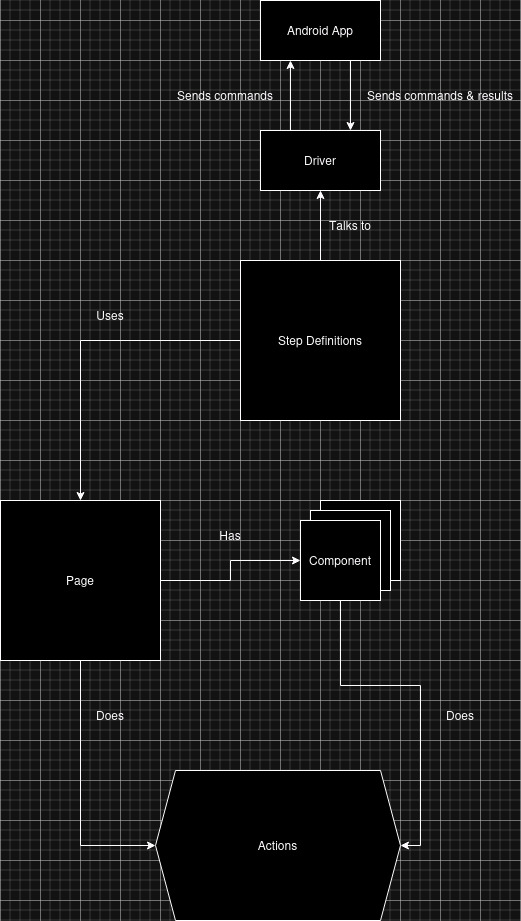

# Ritech QA Assignement

Application under test: [WebDriverIO Demo Android App](https://github.com/webdriverio/native-demo-app/releases)

### Running the tests
If you are using a Debian based Linux distro like Ubuntu, just run `./BuildAndTest.sh` and everything should be fine.
Please make sure you have all the dependencies installed. This project was built with .NET 8.

In any other OS you can run `dotnet build` and then `dotnet test`.

---

### Project structure
```text
-- Features                 // Where the feature files live
 |-- Login                  // The folder 
 |   -- Login.feature       // BDD|Gherkin scenarios
 |   -- README.MD           // Extra details about the feature

-- Source                   // The folder where all the source code lives
 |-- Actions                // The place where page actions reside
 |-- Components             // The place where page components reside
 |-- Hooks                  // Hooks for test execution
 |-- Pages                  // Page objects
 |-- StepDefinitions        // Step definitions liked with feature files
 |-- Utils                  // Helpers and support classes
```

---

### Explaining the logic


---

### Details & Dependencies
- Operating system where the project was developed: Ubuntu 24.10
- .NET 8
- NUnit
- Specflow
- Appium 2.12.1
    - Appium gestures plugin
- Android Studio, SDK and related tools
    - emulated device: Pixel 8 Pro API 35
- livingdoc dotnet tool for test report generation

---

## Thoughts

I chose to do the assignement in C# and Appium since 